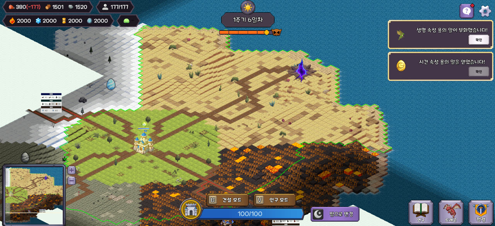
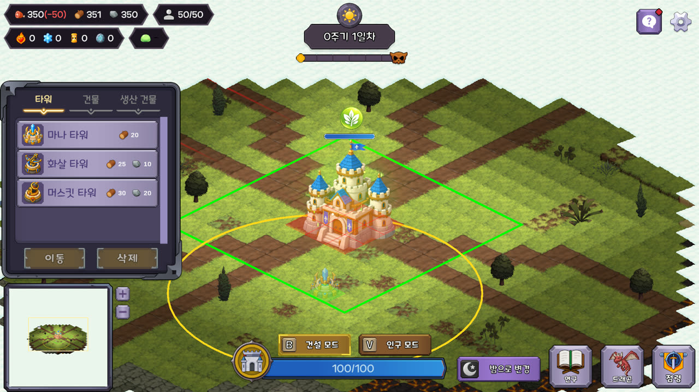
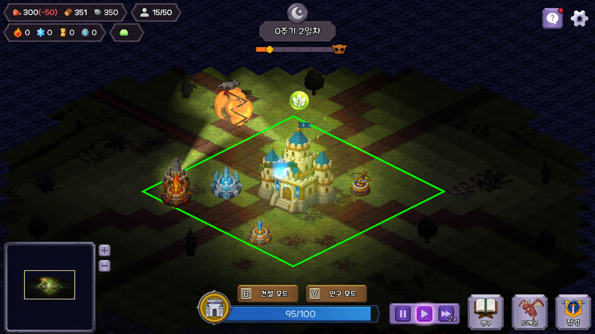
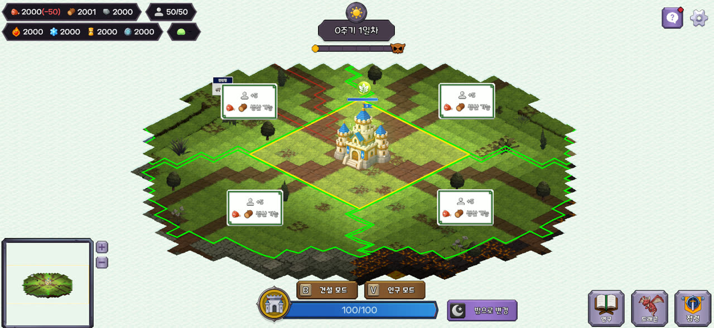
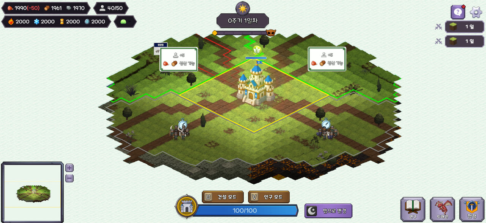
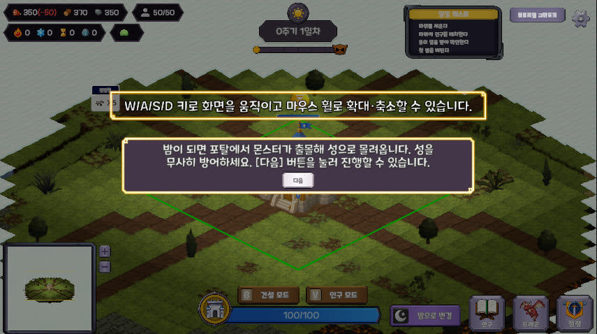
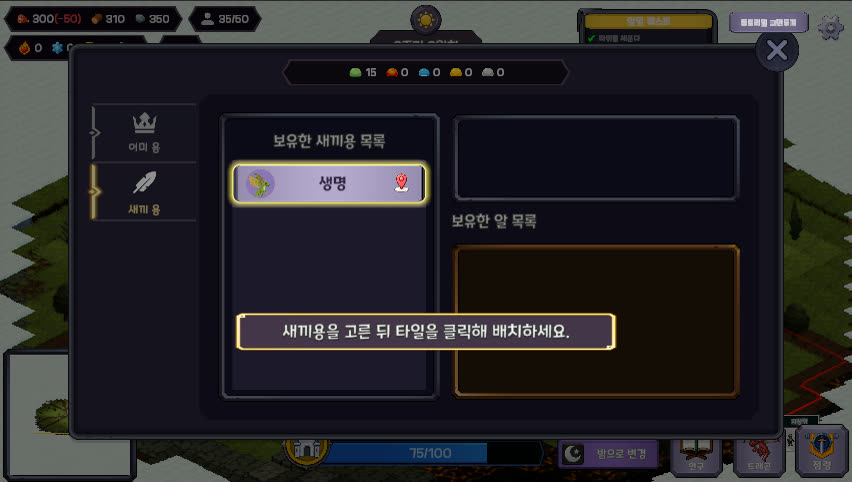
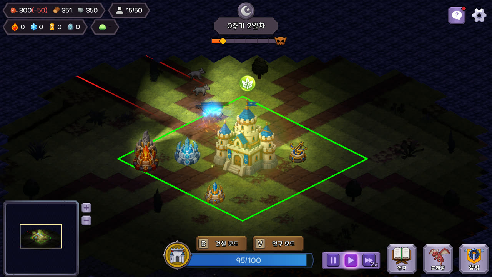
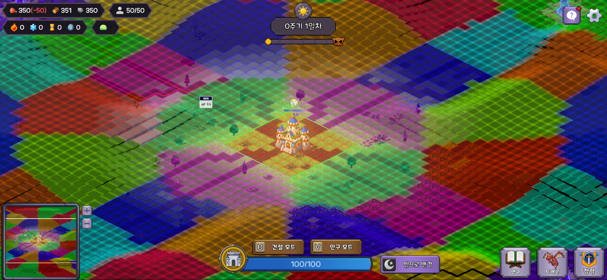

# Tower and Dragons

낮에 도시를 키우고, 밤에 포탈에서 몰려오는 괴물로부터 성을 지키는 **타워디펜스 + 도시건설** 게임입니다.

| 항목 | 내용 |
|---|---|
| 장르 · 플랫폼 | 타워디펜스 + 도시건설 · 싱글플레이 · Windows/PC |
| 엔진 | Unity 6000.3.15f1 (URP) · C# |
| 기간 | 2026-07 ~ 2026-09 (프로토타입 → 알파 → 베타 → 제출) |
| 팀 | 4인 팀 프로젝트 — 수성록 프로젝트(기업협약) 3팀 |
| 내 역할 | 클라이언트 프로그래머 — **그리드·건설·점령·튜토리얼·전투 이펙트** 담당 |

> 이 저장소는 4인 팀 프로젝트의 **개인 포트폴리오용 공개본**입니다. 아래 내용은 제가 담당한 파트를
> 중심으로 정리했고, 커밋 해시·PR 번호 단위의 근거는 [`Docs/Contributions/이하늘.md`](Docs/Contributions/이하늘.md)에 있습니다.
> (문서의 `#nnn` PR 번호는 팀 작업 저장소 기준이라 이 저장소에서는 열리지 않습니다.)

---

## 게임 소개

**"낮의 선택이 밤의 생존을 결정한다"** — 용의 운용 × 인구의 배분 × 전략적 확장

- **하루 = 낮 → 밤 → 정산.** 낮에는 시간 제한 없이 건설·점령·연구·용 설정을 하고, 밤에는 웨이브를 전멸시켜야 다음 날로 넘어갑니다.
- **인구 배분.** 한정된 인구를 타워(방어)·생산시설·연구·점령 원정이 나눠 씁니다. 타워는 인구가 없으면 쏘지 않습니다.
- **점령 = 확장.** 인접 청크에 원정을 보내 밤을 버티면 영토·인구·특화 자원을 얻지만, 확장할수록 적이 강해집니다.
- **용.** 어미용은 5속성 중 하나로 낮에 전환하고 밤에 스킬을 쓰며, 새끼용은 건물 옆에 배치해 생산/공격 버프를 줍니다.
- **승리** 28일차 최종 보스 격파 (보스 7·14·21·28일차) / **패배** 메인 성 파괴

상세 기획은 [`Docs/기획종합_v2.md`](Docs/기획종합_v2.md), 조작·플레이 순서는 [`Docs/게임_플레이_가이드.md`](Docs/게임_플레이_가이드.md)를 참고하세요.

## 스크린샷

| | |
|:--:|:--:|
|  |  |
| 건설 모드: 고스트 프리뷰·사거리·몬스터 경로 | 밤 전투: 불 타워 명중 이펙트 |
|  |  |
| 점령 모드: 접경 청크 하이라이트·보상 미리보기 | 점령 원정: 출격 마커와 남은 기간 |
|  |  |
| 튜토리얼: 1일차 강제 시퀀스 오버레이 | 튜토리얼: 새끼용 배치 안내 |
|  |  |
| 밤 전투: 얼음 타워 명중 이펙트 | 청크 디버거: 맵 전체 청크 분할 확인용 |

- 자원 순환 구조: [`Docs/자원순환_플로우차트.svg`](Docs/자원순환_플로우차트.svg)

---

## 담당 파트

**그리드 위에서 벌어지는 낮의 운영 전반**(타일/청크 그리드, 건물 배치, 점령, 자원 노드)과
**신규 플레이어 온보딩**(튜토리얼, 새끼용 가이드)을 맡았고, 베타 시기에는 **타워·몬스터 전투 이펙트와 효과음 연출**을
추가로 담당했습니다. 프로토타입 초기에 그리드와 건설의 기반을 세운 뒤 그 위에 점령·자원 노드·봉인석을 얹었고,
알파부터는 그 시스템들을 플레이어에게 가르치는 쪽(가이드·튜토리얼)으로 옮겨 갔습니다.

### 1. 그리드 · 청크 시스템 — [`GridMap`](Assets/Scripts/Grid/GridMap.cs) · [`GridCell`](Assets/Scripts/Grid/GridCell.cs) · [`Chunk`](Assets/Scripts/Grid/Chunk.cs) · [`TerrainTileMap`](Assets/Scripts/Grid/TerrainTileMap.cs) ([`Assets/Scripts/Grid`](Assets/Scripts/Grid))

타일맵 위에 셀 단위 데이터([`GridCell`](Assets/Scripts/Grid/GridCell.cs))와 청크 단위 상태([`Chunk`](Assets/Scripts/Grid/Chunk.cs))를 얹은 2계층 그리드. 건설·점령·자원·안개·몬스터 경로가 전부 이 위에서 동작합니다.

- [`GridMap`](Assets/Scripts/Grid/GridMap.cs) — 성 중심 좌표계, 셀 ↔ 청크 매핑, 풋프린트 단위 건설 가능 판정(`CanConstructBuildingFootprint`)
- 초기 청크 분할과 성 중심 좌표 계산 — 프로토타입 시점의 9×9 정사각형 청크 기획을 구현하고, 맵 전체의 청크 분할을 확인하는 [`ChunkDebugger`](Assets/Scripts/ChunkDebugger.cs)를 만들었습니다 (이후 자유 형태 청크로의 전환은 다른 팀원 작업)
- 지형 타일맵([`TerrainTileMap`](Assets/Scripts/Grid/TerrainTileMap.cs)/[`TerrainType`](Assets/Scripts/Grid/TerrainType.cs)), 마우스 타일 선택, 원정 마커 렌더러([`ExpeditionMarkerRenderer`](Assets/Scripts/Grid/ExpeditionMarkerRenderer.cs))
- 세이브 복원 전용 배치 경로 — 복원 시 배치 판정을 **다시 묻지 않는** 이유가 [`GridMap.RestoreBuilding`](Assets/Scripts/Grid/GridMap.cs#L1007) 주석에 기록돼 있습니다 (얼음 새끼용 버프로 풀린 용암 지대가 복원 순서 때문에 건물을 조용히 지우던 문제)

### 2. 건물 배치 시스템 — [`BuildingPlacementController.cs`](Assets/Scripts/Grid/BuildingPlacementController.cs), [`Assets/Scripts/Buildings`](Assets/Scripts/Buildings)

- 셀 사이즈·풋프린트([`FootprintShape`](Assets/Scripts/Buildings/FootprintShape.cs)) 기반 배치, 고스트 프리뷰, `R` 회전, 이동·철거(비용 회수)
- 건설 비용을 빌딩 데이터에 귀속시키는 리팩터링
- **건설 불가 사유 안내** — [`PlacementBlockReason`](Assets/Scripts/Grid/PlacementBlockReason.cs)은 가능/불가 판정을 두 번 구현하지 않고, 이미 실패한 배치에 "왜"만 되묻는 진단용 enum입니다. 값의 순서가 곧 안내 우선순위이며, 사유는 경고창 하나로 전달합니다.
- 선택 상태 변경 이벤트를 **인자 없이** 발화하는 설계 — 구독자가 캐시 대신 매번 현재 상태를 읽게 해, 다섯 갈래로 갈리는 판정과 캐시가 어긋나 알림이 조용히 멈추는 일을 막았습니다 ([`BuildingPlacementController.InteractionStateChanged`](Assets/Scripts/Grid/BuildingPlacementController.cs#L118) 주석)

### 3. 점령 시스템 — [`Assets/Scripts/Conquest`](Assets/Scripts/Conquest)

- 점령 모드 컨트롤러([`ConquestModeController`](Assets/Scripts/Conquest/ConquestModeController.cs), 배타 모드 인터페이스 구현), 원정 상태([`ConquestExpedition`](Assets/Scripts/Conquest/ConquestExpedition.cs)), 청크별 점령 비용 테이블([`ConquestChunkCostTable`](Assets/Scripts/Conquest/ConquestChunkCostTable.cs))
- 인구 코스트 연동, 접경하지 않은 청크 선택 방지, 자투리 점령지 정리와 하이라이트 방식 통일
- 점령 UI ↔ 기능 연결

### 4. 자원 노드 시스템 — [`Assets/Scripts/ResourceNode`](Assets/Scripts/ResourceNode)

- 셀 단위 자원별 생산량 저장([`CellYieldOverrideTable`](Assets/Scripts/ResourceNode/CellYieldOverrideTable.cs), [`ChunkYieldTable`](Assets/Scripts/ResourceNode/ChunkYieldTable.cs))과 노드 데이터 생성 툴·디버거
- 노드 위 생산시설 건설 → 인구 배치 → 생산 → 회수 흐름 연결
- [`PlacementYieldEstimator`](Assets/Scripts/ResourceNode/PlacementYieldEstimator.cs) — "이 자리에 지으면 하루에 얼마가 나오는가" 미리보기. 실제 정산과 **같은 함수**를 호출해 미리보기 숫자와 다음 아침의 실제 지급량이 갈라지지 않게 했습니다.

### 5. 봉인석 · 엔딩

- 포탈 옆 봉인석 설치 위치 판정([`ISealStonePlacementQuery`](Assets/Scripts/Grid/ISealStonePlacementQuery.cs))과 비용, 4포탈 봉인 엔딩 기초 구현

### 6. 새끼용 배치 · 가이드 UI — [`Assets/Scripts/Guide`](Assets/Scripts/Guide), [`Assets/Scripts/Buildings/BabyDragon`](Assets/Scripts/Buildings/BabyDragon)

- 새끼용 설치·이동, 생산/공격 버프 모드 전환, 새끼용 인벤토리
- 가이드 퀘스트 시스템([`GuideQuestSO`](Assets/Scripts/Guide/GuideQuestSO.cs)/[`GuideQuestController`](Assets/Scripts/Guide/GuideQuestController.cs)) — 알 획득·부화 알림, 툴팁, 토스트 스택 구조

### 7. 튜토리얼 — [`Assets/Scripts/Tutorial`](Assets/Scripts/Tutorial), [`Assets/Data/Tutorial`](Assets/Data/Tutorial)

**데이터 기반 튜토리얼.** 단계 하나가 [`TutorialStepSO`](Assets/Scripts/Tutorial/TutorialStepSO.cs)(문구·대상·완료 조건), 챕터가 [`TutorialSequenceSO`](Assets/Scripts/Tutorial/TutorialSequenceSO.cs)로, 순서와 문구는 코드 수정 없이 에셋에서 바꿉니다. 초기 구현 후 플레이테스트에서 "긴 시간 동안 정해진 순서 외의 행동을 못 한다"는 문제가 드러나 구조를 재설계했습니다.

- **1일차 — 강제 시퀀스** [`TutorialRunner`](Assets/Scripts/Tutorial/TutorialRunner.cs): 순서 진행과 완료 조건 감시만 담당하고 표시는 오버레이에 맡깁니다. 도는 동안 아직 설명하지 않은 창·단축키·HUD를 질의 인터페이스([`IExclusiveModeOpenQuery`](Assets/Scripts/UI/IExclusiveModeOpenQuery.cs), [`IDayEndBlockQuery`](Assets/Scripts/Managers/IDayEndBlockQuery.cs), [`IShortcutBlockQuery`](Assets/Scripts/UI/IShortcutBlockQuery.cs) 등)로 막습니다.
- **2일차 이후 — 자유 목표** [`TutorialObjectiveController`](Assets/Scripts/Tutorial/TutorialObjectiveController.cs): 순서를 강제하지 않고 여러 목표를 동시에 추적합니다. 1일차부터 켜 두어 안내보다 먼저 해 버린 행동도 놓치지 않으며, 완료 판정은 이벤트로만 합니다.
- 설계안에 있던 `TutorialDirector`는 **만들지 않기로** 판단했습니다 — 챕터 목록을 줄이면 기존 컨트롤러가 자연히 멈추고, 관문 해제는 러너의 `OnDisable`이 이미 처리하고 있었기 때문입니다 ([`Docs/튜토리얼_재구성_구조_검토.md`](Docs/튜토리얼_재구성_구조_검토.md) §4)
- 튜토리얼 진입점, 본게임 씬 전환 로딩·인계([`TutorialToGameHandoff`](Assets/Scripts/Tutorial/TutorialToGameHandoff.cs)), 엔딩 컷씬 시퀀서

### 8. 타워 · 몬스터 전투 이펙트와 효과음 — [`ProjectileVisual`](Assets/Scripts/Combat/ProjectileVisual.cs) · [`ProjectilePool`](Assets/Scripts/Combat/ProjectilePool.cs) · [`ProjectileImpactPlacement`](Assets/Scripts/Combat/ProjectileImpactPlacement.cs) · [`AttackVfxAnchor`](Assets/Scripts/Combat/AttackVfxAnchor.cs) · [`MonsterStatusVfx`](Assets/Scripts/Combat/Status/MonsterStatusVfx.cs) ([`Assets/Scripts/Combat`](Assets/Scripts/Combat))

- [`ProjectileVisual`](Assets/Scripts/Combat/ProjectileVisual.cs) — 발사·궤적·명중 연출을 [`Projectile`](Assets/Scripts/Combat/Projectile.cs) 로직에서 분리. 궤적을 명중 시 떼어내지 않아 풀([`ProjectilePool`](Assets/Scripts/Combat/ProjectilePool.cs))이 온전한 오브젝트를 돌려받게 했습니다.
- 속성별 발사체·명중 파티클, 근거리 투사체, 빙결·지속 피해 상태이상 이펙트([`MonsterStatusVfx`](Assets/Scripts/Combat/Status/MonsterStatusVfx.cs), 발밑 위치 캐싱), 버프 타워·새끼용 이펙트
- 발사/명중 효과음 데이터 구조와 배선
- 이 프로젝트의 정사영 2D 카메라에서 3D 파티클 에셋이 깨지는 원인과 해결, 만들었다가 **제거한** 근거리 트레이서의 기록까지 [`Docs/타워이펙트_작업노트.md`](Docs/타워이펙트_작업노트.md)에 정리했습니다.

### 9. 아트 · 에디터 작업

- 벌목장·채석장·특화 생산시설 등 건물 스프라이트와 회전 에셋 ([`Assets/Sprites/Buildings`](Assets/Sprites/Buildings))
- Coplay MCP로 파티클·머티리얼·씬 배선을 처리한 일회성 에디터 스크립트 ([`CoplayScripts`](CoplayScripts))

---

## 작업하면서 지킨 원칙

팀 규칙([`CLAUDE.md`](CLAUDE.md))에 따라 지킨 것들입니다.

- **데이터 기반 설계** — 튜토리얼 단계, 점령 비용·기간, 자원 노드 생산량, 공격 이펙트를 전부 ScriptableObject/CSV로 두어 코드 수정 없이 조정
- **판정은 한 곳에서** — 건설 가능 판정, 생산량 산식처럼 "안내"와 "실제 결과"가 같은 함수를 부르게 해 어긋남을 구조적으로 차단
- **이벤트 초기화 순서** — 구독은 `Awake`/`OnEnable`, 첫 발화는 `Start` 이후. 다른 오브젝트의 `Start` 순서에 의존하는 초기화는 한 프레임 지연을 명시
- **UniTask** — 코루틴 대신 UniTask, 파괴 시 자동 취소 토큰 전달
- **문자열·매직 넘버 금지** — 언어별 문자열은 스트링테이블 키, 상수는 이름 있는 `const`

## 기술 스택

Unity 6000.3.15f1 · URP 17.3 · Input System · UniTask · DOTween · NavMeshPlus · Newtonsoft.Json

## 실행

1. Unity 6000.3.15f1로 프로젝트를 엽니다.
2. `Assets/Scenes/StartScene.unity`를 열고 Play — 시작 화면에서 튜토리얼 또는 본게임(`SampleScene`)으로 진입합니다.

## 문서

| 문서 | 내용 |
|---|---|
| [`Docs/Contributions/이하늘.md`](Docs/Contributions/이하늘.md) | 내 기여의 커밋·PR 단위 근거 |
| [`Docs/기획종합_v2.md`](Docs/기획종합_v2.md) | 기획 종합 (Single Source of Truth) |
| [`Docs/게임_플레이_가이드.md`](Docs/게임_플레이_가이드.md) | 조작·플레이 순서·몬스터 종류 |
| [`Docs/튜토리얼_재구성_구조_검토.md`](Docs/튜토리얼_재구성_구조_검토.md) | 튜토리얼 재설계 판단 기록 |
| [`Docs/타워이펙트_작업노트.md`](Docs/타워이펙트_작업노트.md) | 전투 이펙트 배선과 겪은 함정 |
| [`Docs/자원노드_시스템_설계.md`](Docs/자원노드_시스템_설계.md) | 자원 노드 설계 |

## 팀

| 이름 | 담당 |
|---|---|
| **이하늘** | 그리드·건설·점령·자원 노드, 튜토리얼·가이드, 전투 이펙트·효과음 |
| 나상욱 | 밤 전투 루프(웨이브·몬스터·포탈), 인구·용·연구와 밸런스 데이터 |
| 조강현 | UI 레이어 전반, 저장·설정·초기 배선 등 게임 전역 인프라 |
| 김지해 | 인게임 UI/UX·시각 연출, 성 시스템, 주민 캐릭터 연출 |

> `Assets/Imported/`의 외부 에셋(Hovl Studio, Layer Lab, Gamemaster Audio 등)은 라이선스상 저장소에 포함하지 않았습니다(`.gitignore`).
> 이 저장소만으로는 프로젝트가 온전히 열리지 않으며, 코드·데이터·문서 열람용입니다.
